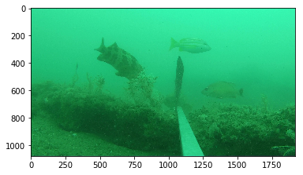
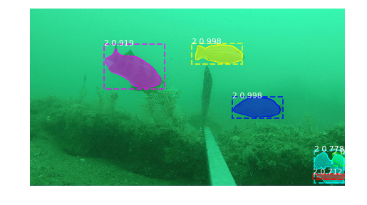

# A Sample Inspired by a PyTorch Port of MaskRCNN for Instance Segmentation

Inspired by:  https://github.com/multimodallearning/pytorch-mask-rcnn

**NOTES**:
* This project is working with _PyTorch 0.4.1_.  If you'd like to help update this, please feel free to fork and create a PR.
* There are two C-extensions that require the NVIDIA compiler and CUDA support.

## Setup

System Tested (Linux and NVIDIA GPU required with CUDA/cuDNN):
* CUDA 9.0
* NVIDIA Tesla K80
* Ubuntu 16.04

These sets of Jupyter notebooks may also be run in a Docker container running on CUDA-capable GPU hardware.

## Base Model

* Download the COCO model (base for transfer learning) from [google drive](https://drive.google.com/drive/folders/1LXUgC2IZUYNEoXr05tdqyKFZY0pZyPDc).  You could also choose to start with the ImageNet model.

## Setup and Demo

Work through the notebooks:

* Setup.ipynb - install the PyTorch extensions and grab a few other tools
* Demo.ipynb - to test setup and perform inference with a base model

### Collect and Label Custom Data

1. Choose images with your object(s) of interest
2. Label with the VGG Image Annotator tool (http://www.robots.ox.ac.uk/~vgg/software/via/)

 
Adult Schoolmaster Snappers (Lutjanus apodus); Source: Florent Charpin, http://reefguide.org/pixhtml/schoolmaster2.html
 

### Train

* Train.ipynb - train on custom-labeled data, supported by a custom PyTorch `DataSet` class (`fish_pytorch_style.py`)

## Wish to Build PyTorch for Your System?

If you wish to build PyTorch latest or from a commit, follow one of the two notebooks:

* InstallPyTorchSourceCUDA.ipynb - build from source with CUDA support

## Additional Information and Credits

* See the original repo for more information beyond the two notebooks.  https://github.com/multimodallearning/pytorch-mask-rcnn
* See this original blog post for some of the concepts and processes behind the PyTorch and, subsequently, this repo (the TensorFlow version): https://engineering.matterport.com/splash-of-color-instance-segmentation-with-mask-r-cnn-and-tensorflow-7c761e238b46
* Related project - https://github.com/svanbodegraven/Machine-Learning-Containers
* Related project - https://github.com/Azadehkhojandi/computer-vision-fish-frame-proposal
* Merging VGG annotations - https://github.com/Azadehkhojandi/VGG-Image-Annotator-Json-Merger

> TIP:  You can run this project inside a Docker image such as the `rheartpython/cvdeep` public image that has many Deep Learning frameworks preinstalled.  (more info at https://github.com/michhar/custom-jupyterhub-linux-vm)
