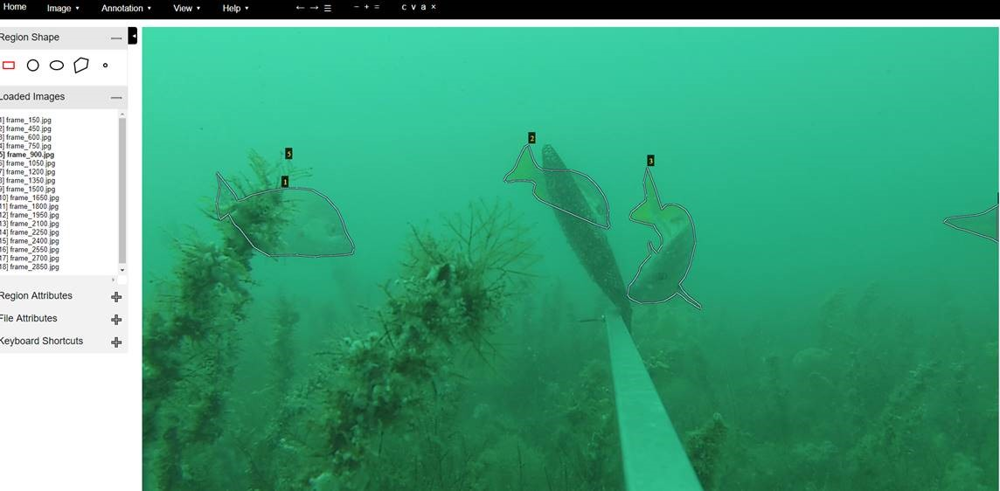

# A Sample Inspired by a PyTorch Port of MaskRCNN for Instance Segmentation

Example notebooks and updated project files from the PyTorch MaskRCNN port:  https://github.com/multimodallearning/pytorch-mask-rcnn

Then see `Setup_and_Demo.py` for setup and `Train_Fish.ipynb` for the Dataset configuration, training and evaluation code.

Labeling with the VGG Image Annotator tool (http://www.robots.ox.ac.uk/~vgg/software/via/):

 
Adult Schoolmaster Snappers (Lutjanus apodus); Source: Florent Charpin, http://reefguide.org/pixhtml/schoolmaster2.html
 

See the original repo for more information beyond the two notebooks.

See this original blog post for some of the concepts and processes behind the PyTorch and, subsequently, this repo (the TensorFlow version): https://engineering.matterport.com/splash-of-color-instance-segmentation-with-mask-r-cnn-and-tensorflow-7c761e238b46

Note:  Running this example will need data in a folder called `fish_pics` for the data (of fish or any object really) and a `logs` folder to contain model files.  Note that at each epoch a trained model is produced unless code is modified otherwise.

> TIP:  You can run this project inside a Docker image such as the `rheartpython/cvdeep` public image that has many Deep Learning frameworks preinstalled.  (more info at https://github.com/michhar/custom-jupyterhub-linux-vm)
